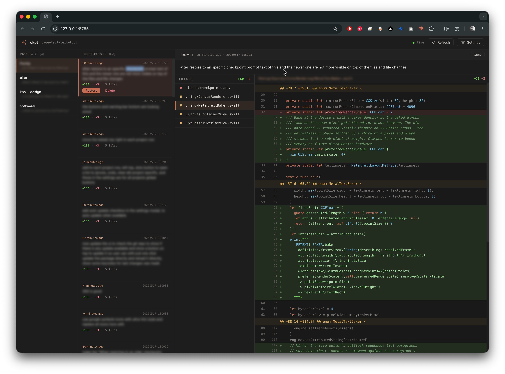
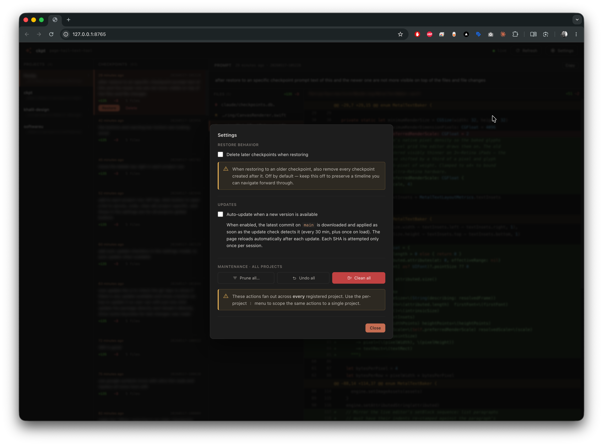
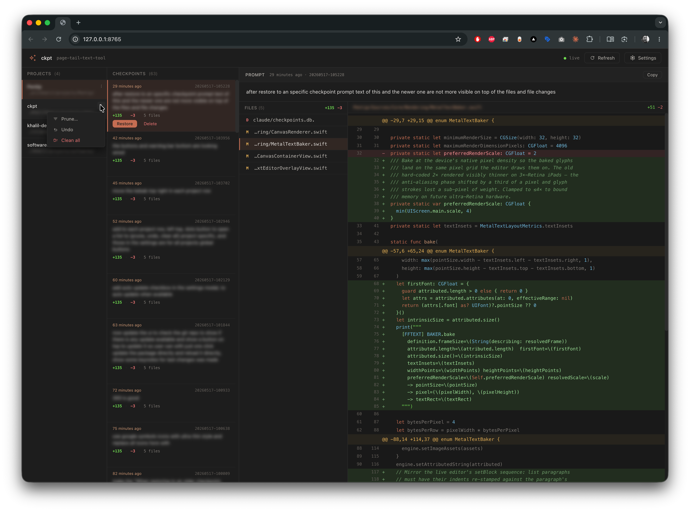
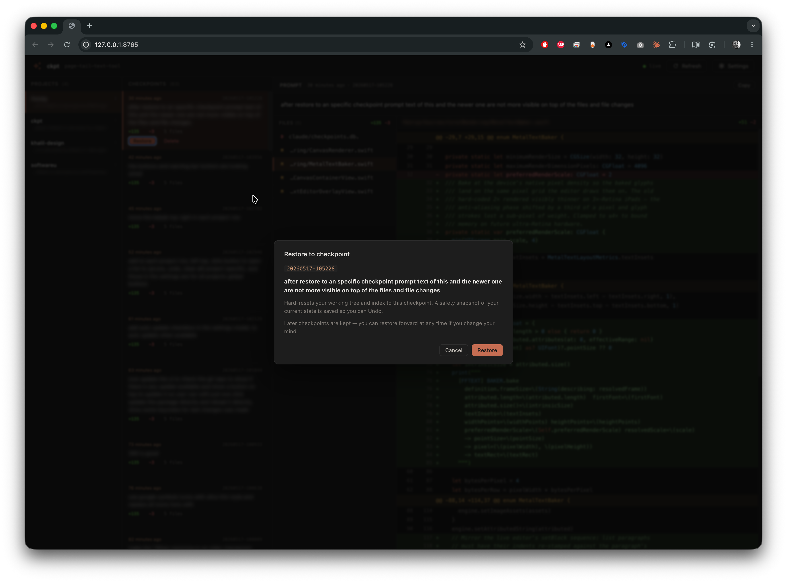

# ckpt

Per-turn git-ref checkpoints for Claude Code — across multiple projects, with a web UI.

Every assistant turn auto-snapshots your working tree into a private git ref namespace (`refs/claude-checkpoints/*`), labelled with the first line of your prompt. Snapshots survive auto-compaction, session restart, and machine reboot. Your working tree, index, and visible git history stay untouched.

## Screenshots

<table>
  <tr>
    <td width="50%" align="center">
      <a href="docs/screenshots/main-ui.png">
        
      </a>
      <br/>
      <sub>Main UI — projects, checkpoints, prompt &amp; diff</sub>
    </td>
    <td width="50%" align="center">
      <a href="docs/screenshots/settings.png">
        
      </a>
      <br/>
      <sub>Settings dialog</sub>
    </td>
  </tr>
  <tr>
    <td width="50%" align="center">
      <a href="docs/screenshots/project-actions.png">
        
      </a>
      <br/>
      <sub>Per-project actions</sub>
    </td>
    <td width="50%" align="center">
      <a href="docs/screenshots/restore-dialog.png">
        
      </a>
      <br/>
      <sub>Restore confirmation</sub>
    </td>
  </tr>
</table>

## Install (one line)

```sh
curl -fsSL https://raw.githubusercontent.com/Kassan424kh/ckpt/main/install.sh | sh
```

Or, from a clone:

```sh
git clone https://github.com/Kassan424kh/ckpt && cd ckpt && ./install.sh
```

The installer:

- Drops `ckpt` into `~/.local/bin/`
- Drops the web UI assets into `~/.local/share/ckpt/web/`
- Merges hook registration into `~/.claude/settings.json` (idempotent, preserves anything else you have there)
- Warns if `~/.local/bin` isn't on your `PATH`

Requires `python3`, `git`, and `curl`. Linux + macOS supported.

## Quick start

After install, every `claude` session in any git repo auto-creates checkpoints:

```sh
cd ~/projects/my-app
claude          # use Claude as normal; checkpoints accrue silently

ckpt list       # see them
ckpt ui         # open the multi-project web UI
ckpt restore    # interactive picker for the current repo
```

## Web UI

```sh
ckpt ui
```

A local web server on `127.0.0.1` (no remote exposure) shows:

- **Projects** sidebar — every repo that has ever had Claude running in it
- **Checkpoints** — newest first, with `+N −M · F files` stats per row
- **Prompt pane** — the full user message that produced the selected checkpoint, with a Copy button
- **Files + diff** — color-coded unified diff with line numbers
- **Live updates** — polls every 2.5s; new checkpoints slot in with a pulse animation
- **Actions** — restore (full / per-file), delete, prune, clean, undo, all with confirmation modals

Built with Preact + htm — no build step, single-file React-style components.

## MCP server

`ckpt` ships with a built-in [Model Context Protocol](https://modelcontextprotocol.io) server so any MCP-compatible agent — Claude Code, Claude Desktop, custom SDK agents — can connect over stdio and browse every checkpoint on this machine, across every project.

Configure it once:

```jsonc
// ~/.claude.json (Claude Code) or your MCP client's config
{
  "mcpServers": {
    "ckpt": {
      "command": "ckpt",
      "args": ["mcp"]
    }
  }
}
```

Then the agent can call these tools:

| Tool | Reads / writes | What it does |
| --- | --- | --- |
| `list_projects` | read | Every project ckpt has seen — id, name, path, last_seen |
| `get_project_status` | read | Branch, total checkpoint count, whether an undo snapshot exists |
| `list_checkpoints` | read | Newest-first list of checkpoints for a project, with `+N -M · F files` stats |
| `get_checkpoint_prompt` | read | The full user prompt that produced a checkpoint |
| `get_checkpoint_files` | read | Files changed by a checkpoint (`status`, `path`) |
| `get_checkpoint_diff` | read | Unified diff of a checkpoint vs its parent — whole-checkpoint or per-file |
| `get_file_at_checkpoint` | read | Full contents of a file as it was at a checkpoint |
| `restore_checkpoint` | **write** | Restore the working tree (or a single file). Always records an undo snapshot |
| `undo_restore` | **write** | Roll back the most recent restore |
| `delete_checkpoint` | **write** | Delete one checkpoint |
| `prune_checkpoints` | **write** | Keep only the N newest |

The `checkpoint_id` accepts the same forms as the CLI: a timestamp like `20260517-112209`, `latest` / `last` / `-1`, `-N` for the Nth-newest, or any unique substring.

Write tools mutate the user's working tree — the MCP client (Claude Code, etc.) mediates user consent before each tool call.

Transport is line-delimited JSON-RPC 2.0 over stdin/stdout; protocol logs (if any) go to stderr so the protocol stream stays clean. No extra dependencies.

## CLI commands

```
ckpt list                       List checkpoints in the current project
ckpt show <ref>                 Show diff of a checkpoint
ckpt restore                    Interactive picker (fzf if installed)
ckpt restore <ref>              Hard-reset working tree to a checkpoint (later ones kept)
ckpt restore <ref> <path>       Restore a single file only
ckpt undo                       Roll back the last restore
ckpt delete <ref>               Delete one checkpoint
ckpt prune <n>                  Keep only the N newest
ckpt clean                      Delete all checkpoints
ckpt latest                     Show info about the newest
ckpt projects                   List all known projects
ckpt ui                         Launch the web UI
ckpt migrate                    Migrate an old in-repo .claude/ setup to this one
```

`<ref>` accepts: `latest` / `last` / `-1` (newest), `-N` (Nth-newest), full timestamp `20260515-112725`, partial substring, or full refname.

## How it works

```
~/.local/bin/ckpt                            single Python entry, all modes
~/.local/share/ckpt/web/                     UI assets (html + js + css)
~/.local/share/ckpt/projects.db              per-machine index of known projects
~/.claude/settings.json                      hooks registered here (user-global)

<each project>/.claude/checkpoints.db        prompts + checkpoint metadata
<each project>/.git/refs/claude-checkpoints/ snapshot refs (immutable commits)
```

- A `UserPromptSubmit` hook saves the **full** user prompt into the project's local SQLite database.
- A `Stop` hook fires after each assistant turn. It builds a snapshot using a temporary index + `git add -A` + `git commit-tree` so modifications, deletions, AND new files (respecting `.gitignore`) all land in the tree. The live index and working tree are untouched.
- The snapshot's first-line message becomes the git commit message; the full prompt is recorded alongside in SQLite.
- Aggregate diff stats (`+N / −M / F files`) are computed once at creation and cached.

## Migration from per-project install

If you already have hooks installed inside a specific repo (the older `.claude/hooks/...` setup), run:

```sh
cd <project>
ckpt migrate
```

This:

1. Registers the project in the per-machine index
2. Removes the in-repo hook scripts, CLI, UI, and CHECKPOINTS.md
3. Strips the redundant `hooks` block from the project's `.claude/settings.json`
4. **Keeps** `.claude/checkpoints.db` and `refs/claude-checkpoints/*` — your data isn't touched

## `.gitignore` recommendation

Add to each project:

```
.claude/checkpoints.db
.claude/checkpoints.db-journal
.claude/checkpoints.db-wal
.claude/checkpoints.db-shm
```

(Per-machine prompt history — not something you want committed.)

## Uninstall

```sh
rm "$HOME/.local/bin/ckpt"
rm -rf "$HOME/.local/share/ckpt"
# Then edit ~/.claude/settings.json and remove the two `ckpt --hook` entries.
```

Existing per-project checkpoints (refs and SQLite db) are unaffected.

## License

MIT
